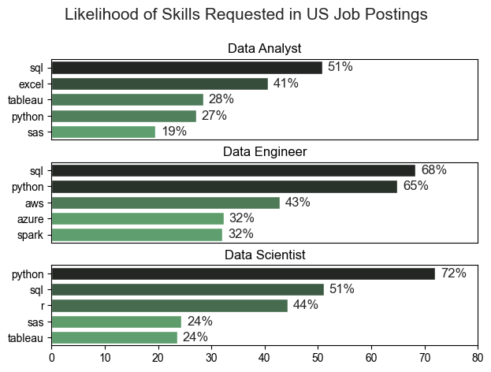
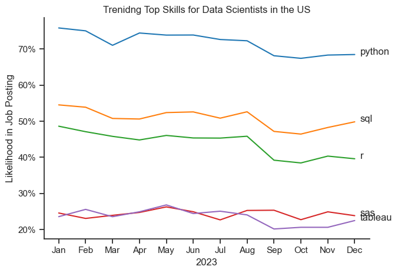
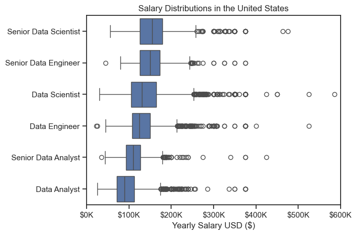
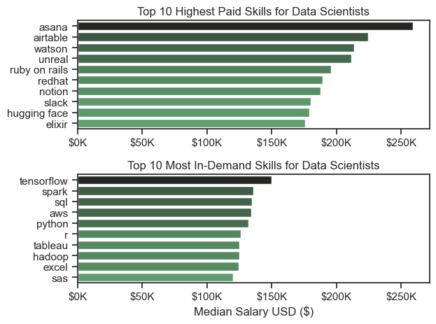
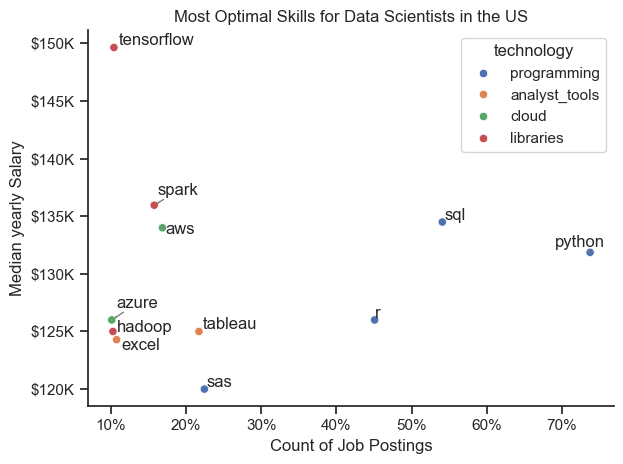

# Overview (Introduction)
Welcome to my analysis of the data job market, focusing on data scientist roles. This project was created out of a desire to navigate and understand the job market more effectively. It delves into the top-paying and in-demand skills to help find optimal job opportunities for data scientists.

The data sourced from [Luke Barousse's Hugging Face Website](https://huggingface.co/datasets/lukebarousse/data_jobs) which provides a foundation for my analysis, containing detailed information on job titles, salaries, locations, and essential skills. Through a series of Python scripts, I explore key questions such as the most demanded skills, salary trends, and the intersection of demand and salary in data science.

# The Questions

Below are the questions I want to answer in my project:
1. What are the skills most in demand for the top 3 most popular data roles?
2. How are in-demand skills trending for Data Scientists?
3. How well do jobs and skills pay for Data Scientists?
4. What is the most optimal skill to learn for Data Scientists?

# Tools I Used
For my deep dive into the data scientist job market, I harnessed the power of several key tools:
- **Python:** The backbone of my analysis, allowing me to analyze the data and find crucial insights. I also used the following Python libraries:
  - **Pandas Library:** This was used to analyze the data
  - **Matplotlib Library:** To visualize the data.
  - **Seaborn Library:** Helped me create more advanced visuals.
- **Jupyrer Notebooks:** The tool I used to run my Python scripts which let me easily include my notes and analysis.
- **Visual Studio Code:** My go-to for executing my Python scripts.
- **Git & GitHub:** Essential for version control and sharing my Python code and analysis.

# Data Preparation and Cleanup
Thi ssection outlines the steps taken to prepare the data for analysis, ensuring accuracy and usability.

## Import & Clean Up Data
I start by importing necessary libraries and loading the dataset, followed by initial data cleaning tasks

# The Analysis
Each Jupyter notebook for this project aimed at investigating specific aspect of the data job market. Here's how I approached each question:
## 1. What are the most demanded skills for the top 3 most popular data roles?
To find the most demanded skills for the top 3 most popular data roles, I filtered out those positions by which ones were the most popular, and got the top 5 skills for these top 3 roles. This query highlights the most popular job titles and their top skills, showing which skills I should pay attention to depending on the role I'm targeting.

View my notebook with detailed steps here: [2_Skills_Count.ipynb](2_Skills_Count.ipynb)

### Visualize Data

```python
fig, ax = plt.subplots(len(job_titles), 1)

sns.set_theme(style='ticks')

for i, job_title in enumerate(job_titles):
    df_plot = df_sckills_pct[df_sckills_pct['job_title_short'] == job_title].head(5)
    sns.barplot(data=df_plot, x='skill_percent', y='job_skills', ax=ax[i], hue='skill_count', palette='dark:g_r')

plt.show()
```

### Results


### Insights
- Python is a versatile skill, highly demanded accross all three roles, but most prominently for Data Scientists (72%) and Data Engineers (65%).
- SQL is the most requested skill for Data Analysis and Data Scientists, with it in over half the job postings for both roles. For Data Engineers, Python is the most sought-after skill, appearing in 68% of job postings.
- Data Engineers require more specialized technical skills (AWS, Azure, Spark) compared to Data Analysts and Data Scientists who are expected to be proficient in more general data management and analysis tools (Excel, Tableau).


## 2. How are in-demand skills trending for Data Scientists?

### Visualize Data

```python

from matplotlib.ticker import PercentFormatter

df_plot = df_DS_US_pct.iloc[:, :5]
sns.lineplot(df_plot, dashes=False, palette='tab10')

plt.gca().yaxis.set_major_formatter(PercentFormatter(decilas=0))

plt.show()

```

### Results

*Line graph visualizing the trending top skills for data scientists in the US in 2023*

### Insight:
- Python is the dominant skill for data scientists, remaining significantly higher than all other skills.
- SQL and R are both important but show a slight decline in demand, indicating a possible shift in the industry toward Python as a more versatile tool.
- SAS and Tableau are useful but niche tools, ranking much lower in job postings, suggesting these may be more specialized or supplementary skills rather than core competencies for data science.

In summary, the chart highlights that mastering Python and SQL is crucial for data scientists, while familiarity with R, SAS, and Tableau can provide added value depending on the specific role or industry.


## 3. How well do jobs and skills pay for Data Scientists?

### Salary Analysis for Data Nerds

#### Visualize Data

```python
sms.boxplot(data=df_US_top6, x='salary_year_avg', y='job_title_short', order=job_order)

ticks_x = plt.FuncFormatter(lambda x, _: f'${int(x/1000)}K')
plt.gca().xaxis.set_major_formatter(ticks_x)
plt.show()

```

#### Result

*Box plot visualizing the salary distributions for the top 6 data jobs titles.*

#### Insight:
- Data Science and Engineering roles are highly compensated in both mid-level and senior positions, with notable outliers among the highest earners. These roles are typically more technical and require specialized skills.
- Data Analyst roles have much lower salaries and less variation, which is expected as these positions often serve as entry points into data careers.
- Seniority directly correlates with higher pay and wider variability, as demonstrated by the large range in the senior roles’ salaries. Senior-level professionals in data tend to have higher and more varied compensation, reflecting experience, leadership roles, and specialized knowledge.
- Top-paying roles are in data science and engineering, particularly at senior levels, which is consistent with the demand for expertise in these fields.

### Highest Paid & Most Demanded Skills for Data Scientists

#### Visualize Data

```python

fig, ax = plt.subplots(2, 1)

sns.barplot(data=df_DS_top_pay, x='median', y=df_DS_top_pay.index, hue='median', ax=ax[0], palette='dark:g_r')

sns.barplot(data=df_DS_skills, x='median', y=df_DS_skills.index, hue='median', ax=ax[1], palette='dark:g_r')

plt.show()

```

#### Results

*Bar chart visualizing the salary distributions for the top & in-demand skills for data scientists*

#### Insight:
- Divergence in Skills: While some of the highest-paid skills (like Watson, Unreal Engine) may be highly specialized or uncommon in typical data science roles, the most in-demand skills focus on foundational technologies such as Python, SQL, and cloud computing.
- Career Strategy: To maximize earning potential, specializing in niche, cutting-edge technologies (AI platforms, software development frameworks) may be key. On the other hand, building a strong base in the core, highly in-demand skills (like Python, SQL, TensorFlow) will make you more marketable.
- Broader Skillsets for High Pay: Many of the top-paid skills are not directly tied to machine learning or statistics but extend into software development, cloud architecture, and collaborative tools. This suggests that high-paying roles may look for a broader skillset beyond traditional data science.

If you’re targeting a high-paying data science role, focusing on niche but high-impact skills could be a valuable strategy, while building a solid foundation in core tools will ensure you remain competitive in the broader job market.​


## 4. What is the most optimal skill to learn for Data Scientists?
#### Visualize Data

```python
from adjustText import adjust_text
import matplotlib.pyplot as plt

plt.scatter(df_DS_skills_high_demand['skill_percent'], df_DS_skills_high_demand['median_salary'])
plt.show()

```

#### Results

*A scatter plot visualizing the most optimal skills (high paying & high demand) for data scientists in the US*

#### Insight:
- The scatter plot shows that most of the `programming` skills (colored blue), such us Python and SQL are highly sought after, reflecting their importance in data manipulation and analysis. 
- Cloud Skills (colored green) like AWS and Azure are also in demand, indicating the growing need for cloud computing expertise in data science roles.
- Specialized Tools Libraries (colored red) -- TensorFlow and Spark -- command higher salaries, suggesting that expertise in these areas is particularly valuable.


Skills like Python and SQL, which are in high demand, offer competitive salaries. However, specialized skills like TensorFlow, despite lower demand, can lead to higher compensation. The demand for data science professionals continues to grow, with companies willing to pay top dollar for expertise in key areas

# What I Learned
Throughout this project, I deepened my understanding of the data scientists job market and enhanced my technical skills in Python, especially in data manipulation and visualization. Here are a few specific things I learned:
- **Advanced Python Usage:** Utilizing libraries such as Pandas for data manupulation, Seaborn and Matplotlib for data visualization, and other libraries helped me perform complex data analysis tasks more efficiently.
- **Data Cleaning Importance:** I learned that thorough data cleaning and preparation are crucial before any analysis can be conducted, ensuring accuracy of insights derived from the data.
- **Strategic Skill Analysis:** The project emphasized the importance of aligning one's skills with market demand. Understanding the relationship between skill demand, salary, and job availability allows for more strategic career planning in the tech industry.

# Insights
This project provided several general insights into the data job market for data scientists:
- **Skill Demand and Salary Correlation:** The demand for specific skills like Python and SQL correlates with higher salaries, particularly for roles that require advanced technical expertise. Specialized skills in cloud platforms and big data tools further enhance salary prospects, especially for Data Engineers.
- **Market Trends:** Overall, the market trends indicate a growing preference for Python as the primary tool for data science, with a gradual decline in the demand for SQL and R. Specialized tools like SAS and Tableau remain relevant but are not as central to the core skill set expected of data scientists.
- **Economic Value of Skills:** To secure a high-paying data science role, it’s beneficial to focus on niche but high-impact skills while also building a strong foundation in core tools. Skills like Python and SQL are in high demand and offer competitive salaries, ensuring you remain competitive in the broader job market. However, specialized skills such as TensorFlow, despite being in lower demand, can lead to higher compensation, reflecting the economic value of expertise in key areas.

# Chanllenges I Faced

This project was not without its challenges, but it provided good learning opportunities:
- **Data Inconsistencies:** Handling missing or inconsistent data entries requires careful consideration to ensure the integrity of the analysis.
- **Complex Data Visualization:** Designing effective visual representations of complex datasets was challenging enough, but conveying those insights clearly and compellingly added an additional layer of complexity.
- **Balancing Breadth and Depth:** Deciding how deeply to dive into each analysis while maintaining a broad overview required constant balancing to ensure comprehensive coverage without getting lost in the details.

# Conclusion
This exploration into the data analyst job market has been incredibly informative, highlighting the critical skills and trends that shape this evolving field. The insights I got enhance my understanding and provide actionable guidance for anyone looking to advance their career in data science. As the market continues to change, ongoing analysis will be essential to stay ahead in data science. This project is a good foundation for future explorations and underscores the importance of continuous learning and adaptation in the data field.

